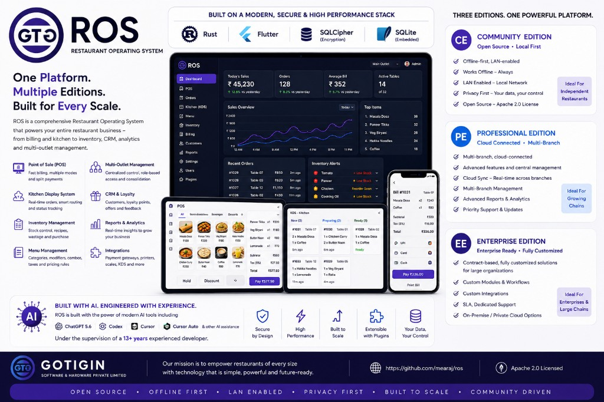

# Gotigin Restaurant Operating System

Restaurant Operating System (ROS) is an enterprise-grade commercial product developed by Mearaj Bhagad, Founder of GOTIGIN SOFTWARE & HARDWARE PRIVATE LIMITED, during OpenAI Build Week. Unlike a typical hackathon prototype, ROS is designed as a production-ready platform and is used to support our real-world restaurant operations. The project was developed with Rust, Flutter, ChatGPT 5.6, Codex, and other AI assistants to accelerate engineering while maintaining production-quality standards.

**OpenAI Build Week reviewers:** start at
[`openai-build-week/README.md`](openai-build-week/README.md).

**Documentation index:** [`docs/README.md`](docs/README.md).

## Product editions

- **Community** — Free forever, one branch, unlimited local restaurant use.
- **Professional Evaluation** — Planned 14-day access to the Professional capability set after explicit activation.
- **Professional Paid** — Planned one-year entitlement for up to five branches.
- **Enterprise Paid** — Planned one-year entitlement with branch capacity selected in the commercial agreement.

Canonical rules and acceptance gates:
[docs/editions/](docs/editions/README.md).
Community is the active delivery focus; Professional and Enterprise must not be
sold or represented as live until their release evidence exists.

## Architecture

    Flutter and Dart client
        -> generated Flutter/Rust bridge
        -> Rust domain, storage, sync, and security core
        -> SQLCipher-backed SQLite on each provisioned restaurant device

    Professional cloud
        -> provider-neutral Rust OCI service
        -> PostgreSQL and encrypted object storage

Flutter owns the user experience. Rust owns business-critical behavior,
database access, migrations, cryptographic/key-management adapters, and sync.
The client must complete local restaurant operations without an internet
connection.

## Current foundation

- Flutter desktop, tablet, and mobile client scaffold with an adaptive
  local-first dashboard.
- Generated Flutter/Rust integration using flutter_rust_bridge.
- Rust domain invariants for integer money and append-only financial mutations.
- SQLCipher-backed SQLite storage module with WAL, full-synchronous writes,
  foreign keys, encrypted-file tests, wrong-key tests, immutable catalogue,
  financial, inventory, and audit constraints, schema-contract verification,
  and versioned local migrations.
- Rust-owned Community provisioning with an opaque, zeroizing 256-bit database
  key held in the desktop operating-system secure store. The Flutter UI never
  receives the key.
- A Rust-owned local owner-PIN and session foundation: no default PIN, Argon2id
  credential verifier, five-failure local throttle, 15-minute expiring session,
  immutable security facts, and storage-enforced owner/manager/cashier/kitchen
  boundaries. Owners can append a reasoned non-owner role reassignment without
  overwriting prior staff attribution. The local workspace remains redacted
  while locked, and its operational actions are scoped to the authenticated
  staff role in both Flutter and Rust.
- A typed first local workflow: Community restaurant setup and persisted menu
  category and product creation through the generated Flutter/Rust bridge,
  including compact app photos and rights-confirmed restaurant image uploads.
  Owners/managers can reasonedly mark items sold out or resume selling; that
  retained state is enforced again by Rust at checkout. Product-bound optional
  modifiers support immutable names and non-negative price additions; they are
  selected at the counter, priced again by Rust, snapshotted into orders and
  receipts, and archived rather than rewritten.
- An adaptive immediate-counter workflow for dine-in/takeaway cash, card, and
  UPI, or split-tender sales. Rust reloads trusted product prices and atomically commits each
  order, immutable invoice, payment, hash-chained audit records, and local
  future-sync outbox entries before Flutter reports success.
- Held-order/table workflow, immutable kitchen instructions, privacy-safe Kitchen Display state machine,
  reasoned cancellation and refund facts, local reporting/integrity checks, and
  verified same-installation backup snapshots. Recent finalized invoices open
  to an immutable local receipt reprint with historical line prices and
  payment allocations; hardware printing remains intentionally separate.
- Owner-only, branch-scoped audit history verifies local storage before showing
  a bounded privacy-safe timeline of actions, sequences, and timestamps.
- Privacy-safe local customer records with explicit marketing consent,
  append-only profile corrections, owner/manager anonymization, and optional
  branch-scoped attachment to a counter sale.
- Append-only inventory ledger commands for opening stock, purchases, waste,
  adjustments, and atomic deduction of items that have been explicitly made
  stock-tracked, plus a Community stock-ledger interface for viewing balances
  and recording accountable movements. Owner/manager users can append or clear
  reasoned low-stock-alert policy events without altering historical stock.
- CI workflow for Rust, Flutter, and Linux desktop verification.

Provider-neutral taxes and manager/owner discounts are implemented through the
local pricing contract. Dual-person correction approval, suppliers/purchase
documents, recipes/BOM deduction, ESC/POS+PDF receipt encoding, and portable
recovery envelopes are now in the Community storage surface. Remaining
publication blockers include reviewed production SQLCipher artifacts under
`third_party/sqlcipher/`, Authenticode/store identities for public trust,
physical printer acceptance, GCP credential provisioning, and the Section 15
release gates in [PLAN.md](PLAN.md).

Signed website download packaging (Linux AppImage, Windows 10+ installer,
Android APK) is documented in
[docs/runbooks/release-packaging.md](docs/runbooks/release-packaging.md).

See [PLAN.md](PLAN.md) for the six-major-stages release plan and [docs/adr](docs/adr)
for architecture decisions. The Stage 1 developer handoff — including local run,
test, Development-mode, and Release-mode instructions — is in
[docs/runbooks/local-development.md](docs/runbooks/local-development.md).

## Local verification

For the complete local setup, Development run, acceptance smoke test,
troubleshooting guidance, and intentionally fail-closed Release procedure, use
the [local development runbook](docs/runbooks/local-development.md). Its
commands are the CI-equivalent verification path, including dependency
resolution, format checks, Rust tests, Flutter tests, and a native Development
build.

## Security note

Development builds use the bundled SQLCipher path. Release/profile builds use
the fail-closed `production-sqlcipher` path
([sqlcipher-artifact-manifest.md](docs/runbooks/sqlcipher-artifact-manifest.md),
[release-packaging.md](docs/runbooks/release-packaging.md),
[PLAN.md §15](PLAN.md#15-non-negotiable-release-gates)).
Desktop OS key stores are implemented; Android/iOS remain blocked until
secure-store adapters and device smoke tests are accepted.

## License and trademarks

This repository is licensed under the [Apache License, Version 2.0](LICENSE).
You may use, modify, redistribute, and sell this software, including
commercially, under the terms of that license. Redistributions must retain
the [NOTICE](NOTICE) file.

The Apache License does not grant rights to Gotigin's names or branding.
"Gotigin", "Gotigin Software & Hardware Private Limited", and related logos
and product branding are covered by the separate
[trademark policy](TRADEMARKS.md): truthful references to the project's
origin are welcome, but derivative products must not claim ownership of
Gotigin's original work or imply Gotigin affiliation or endorsement, and any
use of the Gotigin name requires a clear independence disclaimer.

Bundled third-party assets and dependencies retain their own licenses.
